# 🍬 Ammu Foods — End-to-End DevOps Transformation Project

> A complete DevOps implementation of a MERN-based production application demonstrating Docker containerisation, Jenkins CI/CD, Kubernetes orchestration, and Prometheus + Grafana observability.

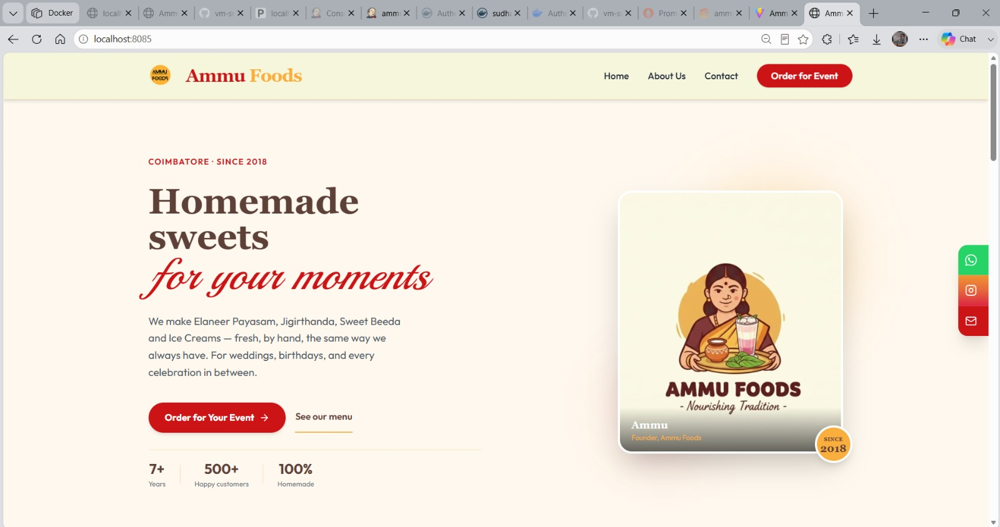

---

## 📋 Table of Contents

- [Project Overview](#-project-overview)
- [Architecture](#-architecture)
- [Tech Stack](#-tech-stack)
- [CI/CD Pipeline](#-cicd-pipeline)
- [Docker Implementation](#-docker-implementation)
- [Jenkins Automation](#-jenkins-automation)
- [Kubernetes Deployment](#-kubernetes-deployment)
- [Monitoring & Observability](#-monitoring--observability)
- [Project Structure](#-project-structure)
- [Key Achievements](#-key-achievements)
- [Learning Outcomes](#-learning-outcomes)
- [Documentation](#-documentation)
- [Future Improvements](#-future-improvements-v2)
- [Author](#-author)

---

## 🎯 Project Overview

**Ammu Foods** is a traditional Indian sweets manufacturing and distribution business based in Coimbatore, Tamil Nadu. The application manages product listings and event catering requests, with email notifications and Google Sheets integration.

### The DevOps Transformation Journey

This repository documents the complete transformation of a working MERN application into a **production-grade, containerised, orchestrated, and monitored system** — implementing the same DevOps practices used in real enterprise environments.

| Phase | What Was Done |
|---|---|
| **Phase 1 — Containerisation** | Dockerised both frontend (multi-stage) and backend (single-stage) with Alpine-based images |
| **Phase 2 — Registry** | Tagged images with build number + git SHA + latest, pushed to Docker Hub |
| **Phase 3 — CI/CD** | Jenkins Declarative Pipeline with Trivy security scanning and automated rollback |
| **Phase 4 — Orchestration** | Deployed to Kubernetes with health probes, resource limits, rolling updates, and Secrets |
| **Phase 5 — Observability** | Integrated prom-client, configured Prometheus pod annotation scraping, built Grafana dashboards |

### Goal

To learn and demonstrate real-world DevOps practices — not just running a web app, but shipping it with the confidence, repeatability, and observability that production systems demand.

---

## 🏗️ Architecture

### System Architecture

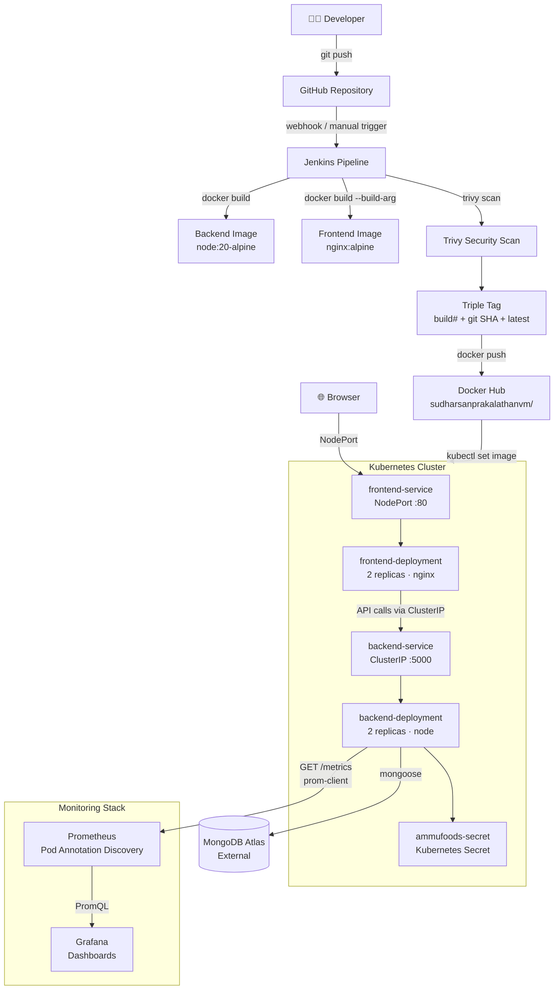

### CI/CD Flow

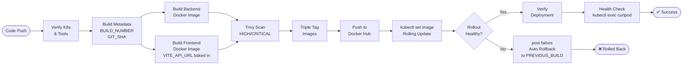

---

## 🛠️ Tech Stack

### Application

| Layer | Technology | Version |
|---|---|---|
| **Frontend Framework** | React | 19.2 |
| **Build Tool** | Vite | 7.3.1 |
| **Styling** | Tailwind CSS | 3.4.17 |
| **Routing** | React Router DOM | 7.12 |
| **Icons** | Lucide React | 0.562 |
| **Backend Runtime** | Node.js | 20 LTS |
| **Backend Framework** | Express.js | 5.2.1 |
| **Database** | MongoDB Atlas | Mongoose 9.1 |
| **Email** | Resend API | 6.12 |
| **Metrics** | prom-client | 15.1.3 |

### DevOps

| Tool | Purpose |
|---|---|
| **Docker** | Containerisation (multi-stage frontend, single-stage backend) |
| **Docker Hub** | Container image registry |
| **Jenkins** | CI/CD pipeline automation (Declarative Pipeline, Windows agent) |
| **Trivy** | Container image vulnerability scanning |
| **Kubernetes** | Container orchestration, rolling updates, health probes |
| **Prometheus** | Metrics collection via pod annotation discovery |
| **Grafana** | Metrics visualisation and dashboards |
| **kubectl** | Kubernetes cluster management |
| **Helm** | Kubernetes package management (kube-prometheus-stack) |

---

## 🔄 CI/CD Pipeline

The Jenkins Declarative Pipeline (`Jenkinsfile`) implements a complete automated delivery workflow with two modes: **DEPLOY** and **ROLLBACK**.

### Pipeline Stages

| # | Stage | DEPLOY | ROLLBACK | Description |
|---|---|---|---|---|
| 1 | **Verify Kubernetes** | ✅ | ✅ | Confirms `kubectl` connectivity to the cluster |
| 2 | **Verify Tools** | ✅ | ✅ | Confirms Docker and Git are available on the agent |
| 3 | **Build Metadata** | ✅ | — | Captures `BUILD_NUMBER` and short `GIT_COMMIT_SHA` |
| 4 | **Build Backend Image** | ✅ | — | `docker build` from `backend/Dockerfile` |
| 5 | **Build Frontend Image** | ✅ | — | `docker build --build-arg VITE_API_URL=...` bakes Kubernetes service URL into the bundle |
| 6 | **Verify Trivy** | ✅ | — | Confirms Trivy scanner is installed |
| 7 | **Trivy Scan** | ✅ | — | Scans both images for HIGH/CRITICAL CVEs (non-blocking) |
| 8 | **Tag Images** | ✅ | — | Tags each image with: build number, git SHA, and `latest` |
| 9 | **Docker Hub Login** | ✅ | — | Authenticates using Jenkins credentials (`dockerhub-creds`) |
| 10 | **Push Backend Image** | ✅ | — | Pushes all three tags to Docker Hub |
| 11 | **Push Frontend Image** | ✅ | — | Pushes all three tags to Docker Hub |
| 12 | **Deploy To Kubernetes** | ✅ | — | `kubectl set image` triggers rolling update on both deployments |
| 13 | **Rollback Deployment** | — | ✅ | Verifies image exists in Docker Hub then applies specified version |
| 14 | **Verify Deployment** | ✅ | ✅ | `kubectl rollout status` + `kubectl get pods` |
| 15 | **Health Check** | ✅ | — | `kubectl exec curlpod` hits `/api/health` from inside the cluster |
| — | **post { failure }** | ✅ | — | Automatically rolls back to `PREVIOUS_BUILD` on any failure |

### Triple Tagging Strategy

Every successful build produces three image tags per service:

```
Build 42  (commit a3f5c12)
├── ammufoods-backend:42         ← Used for Kubernetes deployments
├── ammufoods-backend:a3f5c12    ← Traceability — links image to exact commit
└── ammufoods-backend:latest     ← Convenience for manual testing
```

---

## 🐳 Docker Implementation

### Backend — Single-Stage Build

The backend is a Node.js application with no compilation step, so a single-stage build is appropriate.

```dockerfile
FROM node:20-alpine          # Minimal Alpine base (~5MB vs ~300MB Debian)
WORKDIR /app
COPY package*.json ./        # Copy lockfiles first — layer cache optimisation
RUN npm ci --omit=dev        # Reproducible install, no devDependencies
COPY . .                     # Source copied AFTER install to preserve cache
EXPOSE 5000
CMD ["node", "server.js"]    # Exec form — proper signal handling for K8s
```

### Frontend — Multi-Stage Build

The frontend requires a Node.js build environment but should be served by nginx. Multi-stage eliminates Node.js from the final image entirely.

```dockerfile
# Stage 1: Build
FROM node:20-alpine AS builder
WORKDIR /app
COPY package*.json ./
RUN npm ci
COPY . .
ARG VITE_API_URL             # Injected at build time via --build-arg
ENV VITE_API_URL=$VITE_API_URL
RUN npm run build            # Vite compiles and bakes VITE_API_URL into bundle

# Stage 2: Serve
FROM nginx:alpine            # Final image has NO Node.js, NO source code
COPY --from=builder /app/dist /usr/share/nginx/html
EXPOSE 80
CMD ["nginx", "-g", "daemon off;"]
```

**Image size comparison:**

| Image | Size |
|---|---|
| Node.js with all deps | ~400MB |
| `ammufoods-frontend` (nginx + dist only) | ~25–35MB |

### Docker Hub

Images are published to: [`sudharsanprakalathanvm`](https://hub.docker.com/u/sudharsanprakalathanvm)

- `sudharsanprakalathanvm/ammufoods-backend`
- `sudharsanprakalathanvm/ammufoods-frontend`

### Screenshots

**Docker Hub — Image Registry**

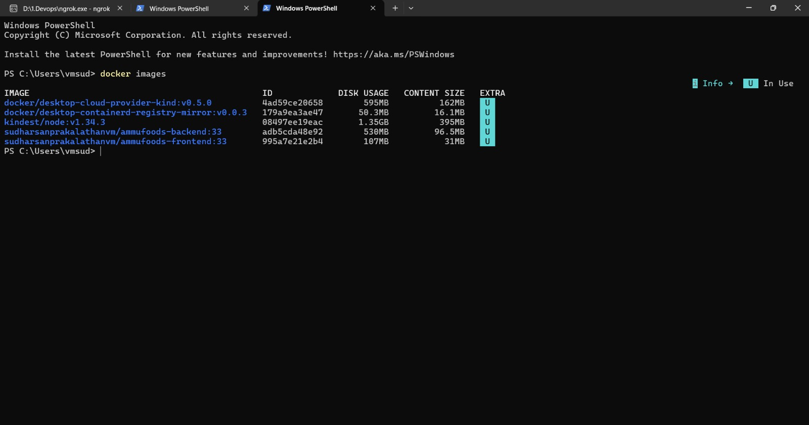

**Backend Image Build**

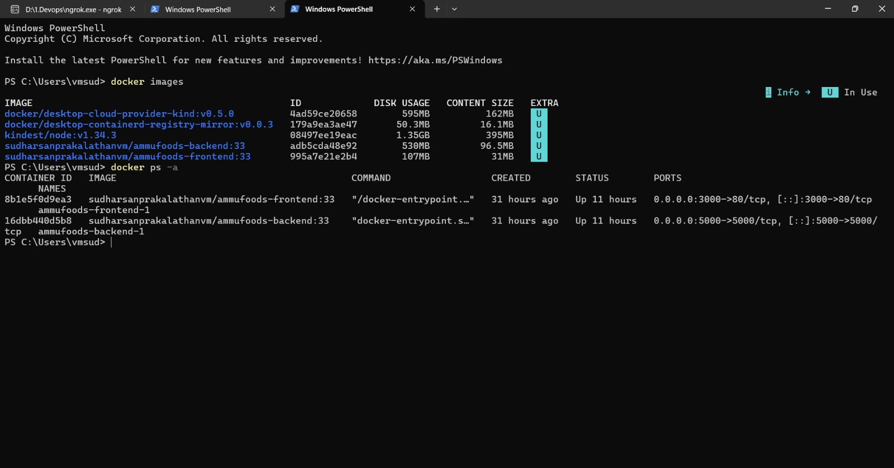

**Frontend Multi-Stage Build**

| Stage 1 — Node Build | Stage 2 — nginx Final |
|---|---|
| 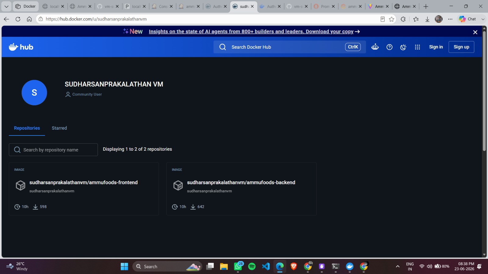 | 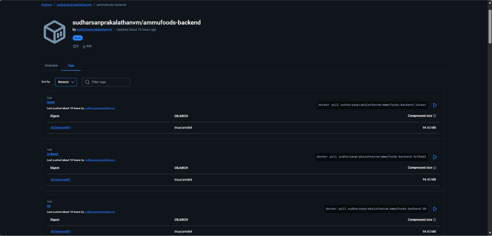 |

**Docker Compose — Local Development**

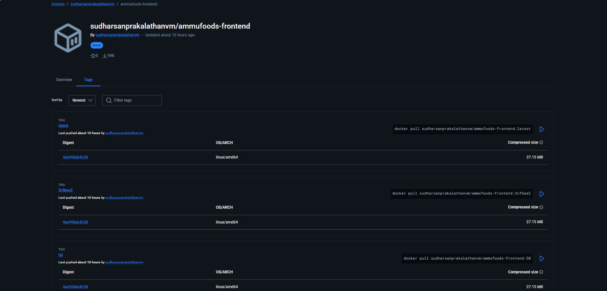

---

## ⚙️ Jenkins Automation

The Jenkins Declarative Pipeline runs on a Windows agent and delivers the full CI/CD flow from source to running Kubernetes pods.

### Key Design Decisions

- **`bat` commands** — Windows CMD syntax throughout (Jenkins agent is Windows)
- **`--build-arg` for VITE_API_URL** — bakes the Kubernetes in-cluster service URL into the React bundle at build time
- **`--exit-code 0` on Trivy** — security scan is informational, does not block deploys
- **`withCredentials`** — Docker Hub token is never exposed in logs or process lists
- **`PREVIOUS_BUILD = BUILD_NUMBER - 1`** — computed before the Kubernetes deploy so the `post { failure }` block always knows what to roll back to

### Screenshots

**Pipeline Overview**

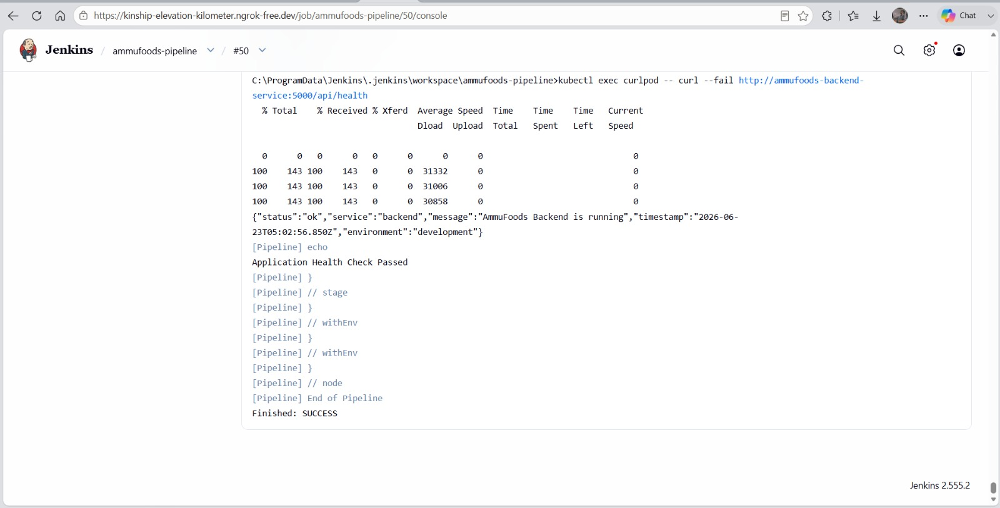

**Build Stages Running**

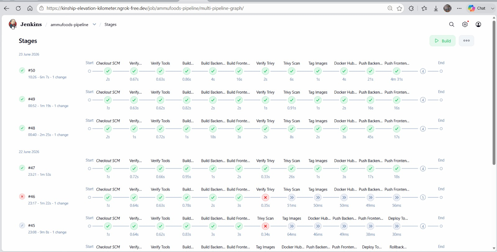

**Successful Pipeline Run**

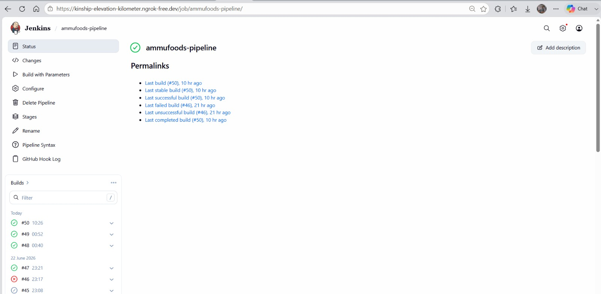

---

## ☸️ Kubernetes Deployment

The application runs on Kubernetes with four manifest files in the `k8s/` directory.

### Deployments

| Deployment | Replicas | Image | Port |
|---|---|---|---|
| `ammufoods-backend` | 2 | `node:20-alpine` | 5000 |
| `ammufoods-frontend` | 2 | `nginx:alpine` | 80 |

### Services

| Service | Type | Port | Purpose |
|---|---|---|---|
| `ammufoods-backend-service` | ClusterIP | 5000 | Internal-only access to the backend API |
| `ammufoods-frontend-service` | NodePort | 80 | External access for browsers |

The backend is intentionally **not** exposed externally. ClusterIP ensures only pods within the cluster can reach it, protecting the MongoDB URI and API keys.

### Secrets

All sensitive environment variables are stored in a Kubernetes Secret (`ammufoods-secret`) and injected via `envFrom: secretRef`. The secret is never committed to Git — it is created imperatively:

```bash
kubectl create secret generic ammufoods-secret \
  --from-literal=MONGO_URI="mongodb+srv://..." \
  --from-literal=RESEND_API_KEY="re_..." \
  --from-literal=ADMIN_EMAIL="..." \
  # ... all other env vars
```

### Health Probes

Both probes hit `/api/health` — a lightweight Express endpoint that returns HTTP 200:

```yaml
readinessProbe:          # Pod only receives traffic when ready
  httpGet:
    path: /api/health
    port: 5000
  initialDelaySeconds: 10   # Wait for Node.js + MongoDB to connect
  periodSeconds: 10

livenessProbe:           # Pod is restarted if unresponsive
  httpGet:
    path: /api/health
    port: 5000
  initialDelaySeconds: 30   # Longer delay to avoid killing a healthy startup
  periodSeconds: 15
```

### Resource Limits

```yaml
resources:
  requests:
    cpu: "100m"      # 0.1 core guaranteed — used by scheduler
    memory: "128Mi"  # 128MB RAM guaranteed
  limits:
    cpu: "500m"      # 0.5 core maximum — throttled if exceeded
    memory: "512Mi"  # 512MB maximum — OOMKilled if exceeded
```

### Prometheus Annotations

The backend pod template includes scrape annotations so Prometheus discovers it automatically:

```yaml
annotations:
  prometheus.io/scrape: "true"
  prometheus.io/path: "/metrics"
  prometheus.io/port: "5000"
```

### Rolling Updates

When Jenkins runs `kubectl set image`, Kubernetes performs a zero-downtime rolling update:

```
Replicas:  [backend:41] [backend:41]
           ↓ New pod starts
           [backend:41] [backend:41] [backend:42 - starting...]
           ↓ Readiness probe passes → old pod terminated
           [backend:41] [backend:42]
           ↓ Second new pod starts, second old pod terminates
           [backend:42] [backend:42] ✅
```

Traffic only routes to a pod after its readiness probe passes — zero downtime guaranteed.

### Screenshots

**All Pods Running**

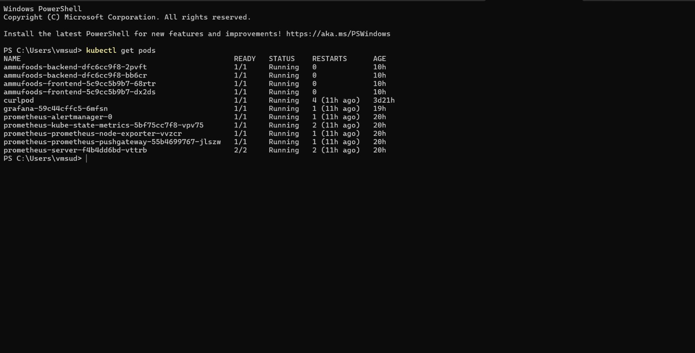

**Deployments and Services**

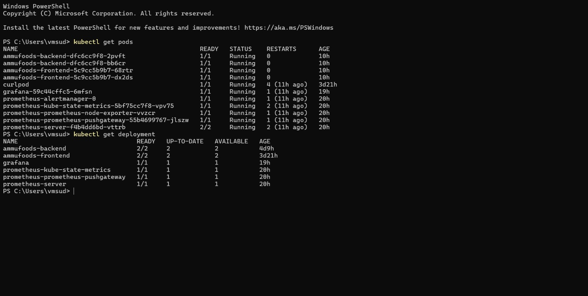

**kubectl get all**

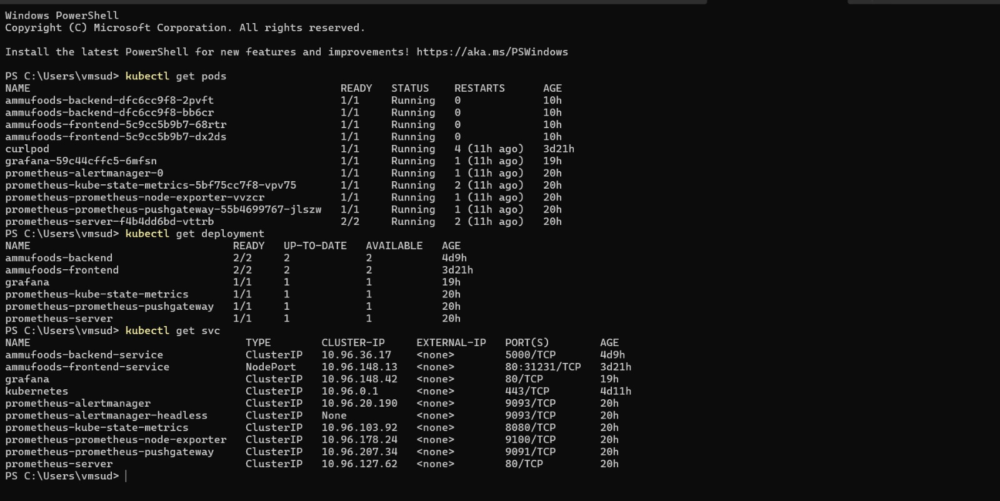

**Rolling Update in Progress**


**Health Check from Inside the Cluster**

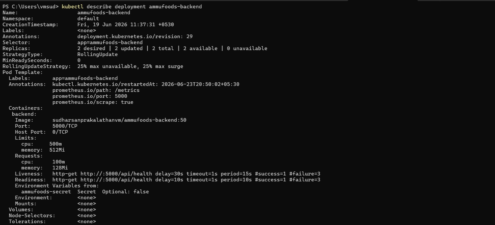

---

## 📊 Monitoring & Observability

### Stack

- **`prom-client`** — Node.js Prometheus client, collects 20+ default runtime metrics
- **Prometheus** — Pull-based metrics collection via Kubernetes pod annotation discovery
- **Grafana** — Visualisation, dashboards, and alerting
- **kube-prometheus-stack** — Helm chart deploying the full monitoring stack

### How It Works

```
Backend Pod (/metrics endpoint)
    │
    │  prom-client.collectDefaultMetrics()
    │  → CPU, Memory, Event Loop, GC, Handles
    │
    ▼
GET http://<pod-ip>:5000/metrics  (every 15 seconds)
    │
    ▼
Prometheus (time-series database)
    │
    │  PromQL queries
    ▼
Grafana Dashboards
```

The `/metrics` endpoint is registered **before** the rate limiter in `app.js` to prevent Prometheus scrapes from being throttled:

```js
// Metrics BEFORE rate limiter — Prometheus scrapes bypass rate limiting
app.use("/metrics", metricsRoutes);
app.use(apiLimiter);
```

### Metrics Collected

| Metric | Type | Description |
|---|---|---|
| `process_cpu_user_seconds_total` | Counter | User-space CPU time |
| `process_resident_memory_bytes` | Gauge | RSS memory usage |
| `nodejs_heap_size_used_bytes` | Gauge | V8 heap currently used |
| `nodejs_eventloop_lag_seconds` | Gauge | Event loop response lag |
| `nodejs_gc_duration_seconds` | Histogram | Garbage collection duration |
| `nodejs_active_handles_total` | Gauge | Active handles (connections, timers) |
| `process_start_time_seconds` | Gauge | Process start timestamp |

### Screenshots

**Prometheus — Targets Showing AmmuFoods Backend**

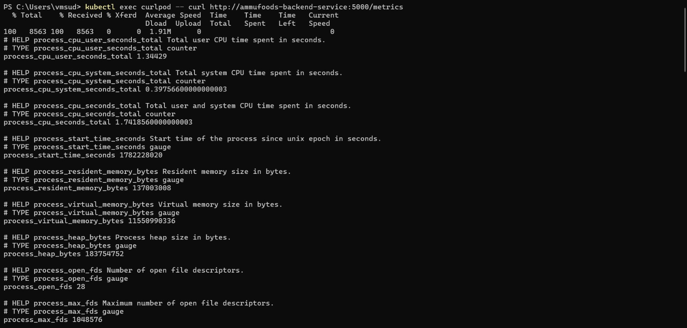

**Prometheus — PromQL Query**

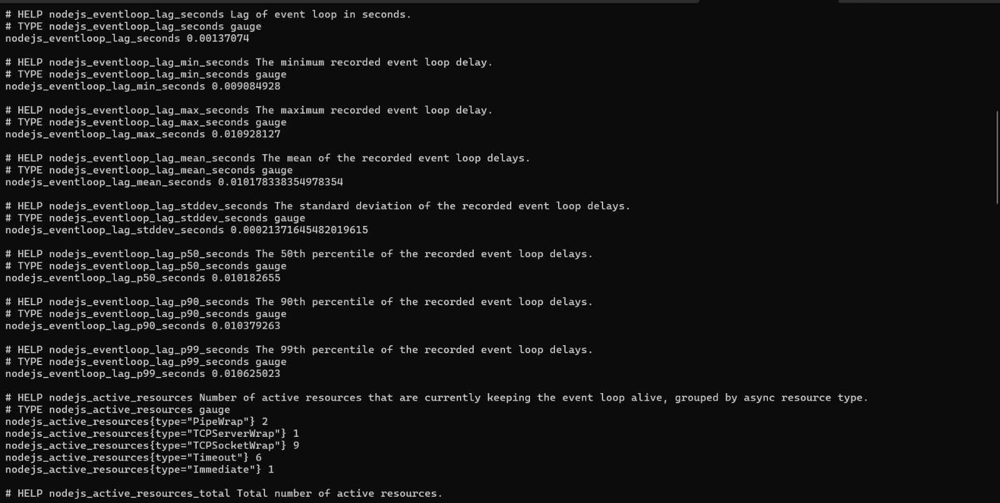

**Grafana — Node.js Dashboard**

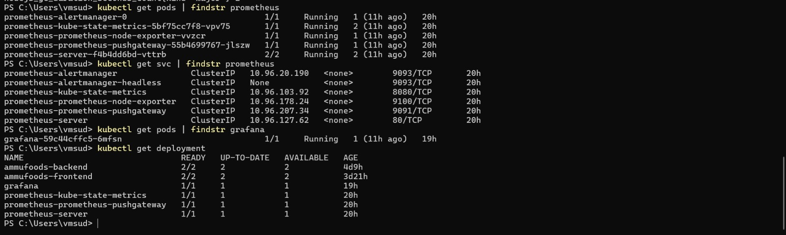

---

## 📁 Project Structure

```
AmmuFoods/
│
├── 📄 Jenkinsfile                    # Declarative CI/CD pipeline
├── 📄 docker-compose.yml             # Local development
├── 📄 docker-compose.prod.yml        # Production Docker Compose
├── 📄 README.md                      # This file
├── 📄 .gitignore
│
├── 🐳 backend/
│   ├── Dockerfile                    # Single-stage node:20-alpine
│   ├── .dockerignore
│   ├── .env.example                  # Environment variable template
│   ├── server.js                     # Entry point
│   ├── package.json
│   └── src/
│       ├── app.js                    # Express app, middleware, routes
│       ├── config/
│       │   ├── cloudinary.js
│       │   ├── db.js                 # MongoDB connection with error hints
│       │   └── oauth.js
│       ├── controllers/
│       │   ├── event.controller.js
│       │   └── product.controller.js
│       ├── middlewares/
│       │   ├── error.middleware.js
│       │   ├── rateLimit.middleware.js
│       │   └── validate.middleware.js
│       ├── models/
│       │   ├── EventRequest.model.js
│       │   └── Product.model.js
│       ├── routes/
│       │   ├── event.routes.js       # /api/events
│       │   ├── metrics.routes.js     # /metrics — Prometheus endpoint
│       │   └── product.routes.js     # /api/products
│       ├── services/
│       │   ├── cloudinary.service.js
│       │   ├── mail.service.js       # Resend email
│       │   └── sheets.service.js     # Google Sheets logging
│       └── utils/
│           ├── asyncHandler.js
│           ├── jwt.util.js
│           └── password.util.js
│
├── ⚛️ frontend/
│   ├── Dockerfile                    # Multi-stage: node builder → nginx:alpine
│   ├── .dockerignore
│   ├── .env.example
│   ├── .env.k8s                      # VITE_API_URL for Kubernetes builds
│   ├── netlify.toml                  # Netlify deployment config
│   ├── netlify/functions/health.js   # Serverless health endpoint
│   ├── vite.config.js
│   ├── tailwind.config.js
│   └── src/
│       ├── App.jsx
│       ├── main.jsx
│       ├── index.css
│       ├── assets/                   # Product images, logo
│       ├── components/
│       │   ├── Footer.jsx
│       │   ├── Navbar.jsx
│       │   └── ProductCard.jsx
│       ├── pages/
│       │   ├── Home.jsx              # Landing page + product showcase
│       │   └── Order.jsx            # Event catering request form
│       └── utils/
│           └── api.js               # VITE_API_URL resolution
│
├── ☸️ k8s/
│   ├── backend-deployment.yaml      # 2 replicas, probes, limits, Prometheus annotations
│   ├── backend-service.yaml         # ClusterIP :5000
│   ├── frontend-deployment.yaml     # 2 replicas, nginx
│   └── frontend-service.yaml        # NodePort :80
│
├── 📚 docs/
│   ├── 01-project-overview.md
│   ├── 02-dockerization.md
│   ├── 03-jenkins-cicd.md
│   ├── 04-kubernetes-deployment.md
│   ├── 05-monitoring-prometheus-grafana.md
│   └── 06-troubleshooting.md
│
└── 📸 screenshots/
    ├── 2.jpeg                        # Docker Hub registry
    ├── 3.png                         # Backend Docker build
    ├── 4.1.png → 4.3.png             # Frontend build + Docker Compose
    ├── 5.1.png → 5.3.png             # Jenkins pipeline stages
    ├── 6.1.png → 6.5.png             # Kubernetes pods, services, rolling update
    └── 7.1.png → 7.3.png             # Prometheus targets + Grafana dashboards
```

---

## 🏆 Key Achievements

| Achievement | Details |
|---|---|
| ✅ **Dockerised MERN Application** | Multi-stage frontend image (~30MB), single-stage backend with `npm ci --omit=dev` |
| ✅ **Multi-Environment Docker Build** | `VITE_API_URL` injected via `--build-arg` at build time for different environments |
| ✅ **Jenkins CI/CD Pipeline** | 15-stage Declarative Pipeline with DEPLOY + ROLLBACK modes |
| ✅ **Container Security Scanning** | Trivy integrated into pipeline, scans HIGH/CRITICAL CVEs before push |
| ✅ **Triple Image Tagging** | Every build tagged with build number, git commit SHA, and latest |
| ✅ **Kubernetes Deployment** | Both services running as 2-replica deployments with rolling update strategy |
| ✅ **Kubernetes Health Probes** | Readiness + liveness probes on `/api/health` for zero-downtime deployments |
| ✅ **Resource Management** | CPU and memory requests/limits on backend containers |
| ✅ **Secret Management** | All sensitive config in Kubernetes Secrets, injected via `envFrom: secretRef` |
| ✅ **Automatic Rollback** | `post { failure }` block reverts to `PREVIOUS_BUILD` on any pipeline failure |
| ✅ **Prometheus Monitoring** | `prom-client` exposes 20+ metrics, scraped via pod annotation discovery |
| ✅ **Grafana Dashboards** | Node.js runtime metrics visualised — CPU, memory, event loop, GC |
| ✅ **Production-Style Architecture** | ClusterIP for internal services, NodePort for external access, no secrets in Git |

---

## 📖 Learning Outcomes

### Docker
- Multi-stage builds to produce minimal production images
- Layer caching with strategic `COPY` and `RUN` ordering
- Build-time vs runtime environment variables in containerised apps
- `.dockerignore` to exclude secrets and dev tools from images

### Jenkins
- Declarative Pipeline syntax (`pipeline`, `stages`, `post`, `when`)
- `withCredentials` for secure credential injection
- `bat` commands for Windows CI agents
- `powershell` for capturing command output as pipeline variables
- Parameterised pipelines with choice + string parameters
- Post-action hooks for automated failure recovery

### Kubernetes
- Deployment, Service, and Secret manifests
- ClusterIP vs NodePort service types and when to use each
- `envFrom: secretRef` for clean secret injection
- Readiness vs liveness probes and their timing implications
- Rolling update mechanics and zero-downtime deployments
- `kubectl rollout status` to gate pipeline stages on deployment health
- Resource requests and limits for scheduler efficiency and stability

### Monitoring
- `prom-client` integration — `collectDefaultMetrics()`, registry, content type
- Prometheus pod annotation discovery (`prometheus.io/scrape`, `path`, `port`)
- Why `/metrics` must be registered before rate-limiting middleware
- PromQL basics for querying time-series metrics
- Grafana datasource configuration and dashboard creation

### CI/CD & DevOps Workflow
- Immutable infrastructure — never patch containers, always build and replace
- Git commit SHA as an image identifier for full traceability
- The importance of `kubectl rollout status` as a deployment gate
- Pull model monitoring vs push model
- The difference between `build:` and `image:` in Docker Compose
- Secret rotation strategy (Kubernetes Secret + `rollout restart`)

---

## 📚 Documentation

Detailed technical documentation is available in the `docs/` directory:

| Document | Contents |
|---|---|
| [01 — Project Overview](docs/01-project-overview.md) | Architecture, API endpoints, environment variables reference |
| [02 — Dockerization](docs/02-dockerization.md) | Line-by-line Dockerfile walkthrough, Compose explained |
| [03 — Jenkins CI/CD](docs/03-jenkins-cicd.md) | Every pipeline stage explained, credentials setup, flow diagrams |
| [04 — Kubernetes Deployment](docs/04-kubernetes-deployment.md) | All manifests explained, secrets, probes, rolling updates, kubectl reference |
| [05 — Monitoring](docs/05-monitoring-prometheus-grafana.md) | prom-client, Prometheus scraping, Grafana setup, PromQL examples |
| [06 — Troubleshooting](docs/06-troubleshooting.md) | Real issues encountered and their fixes |

---

## 🚀 Future Improvements (v2)

| Improvement | Description |
|---|---|
| **Ingress Controller** | Replace NodePort with an Ingress resource (nginx-ingress or Traefik) for path-based routing |
| **TLS / HTTPS** | cert-manager + Let's Encrypt for automatic TLS certificate provisioning |
| **ArgoCD** | GitOps-based continuous deployment — Kubernetes state driven from Git |
| **Terraform** | Infrastructure as Code for cloud resource provisioning (VPC, EKS, RDS) |
| **AWS Deployment** | Migrate from local Kubernetes to Amazon EKS for a real cloud environment |
| **Horizontal Pod Autoscaling** | HPA based on CPU/memory metrics for automatic scaling under load |
| **Centralised Logging** | EFK stack (Elasticsearch, Fluentd, Kibana) or Loki + Grafana for log aggregation |
| **Non-Root Container** | Add `USER node` to backend Dockerfile for container hardening |
| **Frontend Health Probes** | Add readiness/liveness probes to the frontend Kubernetes deployment |
| **Blocking Trivy** | Switch to `--exit-code 1` with `--ignore-unfixed` to block deploys with fixable CVEs |

---

## 👨‍💻 Author

**Sudharsan Prakalathan VM**
Sri Eshwar College of Engineering
ECE Department

---

<div align="center">

**Built with ❤️ for traditional Indian sweets — deployed with modern DevOps**

*This project represents a complete DevOps learning journey from a working MERN application to a containerised, orchestrated, and monitored production system.*

</div>
